# Technical Documentation & Architectural Blueprint — Kala Karsa Bakery

Selamat datang di Dokumentasi Teknis Aplikasi **Kala Karsa Bakery (E-Commerce Suite & POS)**. Dokumen ini disusun untuk menjelaskan arsitektur sistem, struktur database (DBML), analisis alur kerja (workflow), diagram permodelan data (DFD, Sequence, Activity), serta laporan pengujian komprehensif menggunakan framework **Pest PHP**.

---

## 1. Analisis `routes/web.php`

Routing pada Kala Karsa Bakery dirancang menggunakan Laravel 13 dengan memadukan **Inertia.js v3** untuk Single Page Application (SPA), serta pengelompokan middleware berbasis peran (*role-based access control*).

Berikut adalah struktur analisis routing yang didefinisikan dalam `routes/web.php`:

### A. Rute Publik (Public Routes)
* **`GET /` (home)**: Halaman landing utama pelanggan (`welcome`). Rute ini secara dinamis memuat katalog produk aktif beserta kategorinya. Jika user telah login, sistem otomatis menyuntikkan data keranjang belanja persistent (`cartItems`) dan kupon aktif milik user (`userCoupons`).
* **`POST payment/callback` (payment.callback)**: Endpoint webhook Midtrans untuk menerima notifikasi status pembayaran transaksi secara *asynchronous* dari gateway pembayaran. Rute ini dikecualikan dari verifikasi CSRF.

### B. Rute Konsumen Terautentikasi (Authenticated Customer Routes)
Di bawah naungan middleware `['auth', 'verified']`, rute ini dikhususkan untuk pelanggan yang terdaftar:
* **Katalog & Detail Produk**:
  * `GET products` (`products.index`): Menampilkan daftar katalog produk.
  * `GET products/{product}` (`products.show`): Menampilkan detail produk secara interaktif beserta ulasan konsumen.
* **Keanggotaan & Kupon**:
  * `GET membership` (`membership.index`): Dashboard member untuk melihat akumulasi poin belanja.
  * `POST membership/register` (`membership.register`): Mendaftarkan pelanggan menjadi member aktif menggunakan nomor telepon.
  * `GET coupons` (`coupons.index`): Katalog kupon diskon yang tersedia.
  * `POST coupons/{id}/redeem` (`coupons.redeem`): Menukarkan akumulasi poin belanja member dengan kupon diskon tertentu.
* **Keranjang Belanja Persistent (Cart)**:
  * `POST cart` (`cart.add`): Menambahkan produk ke keranjang belanja yang disimpan langsung di database.
  * `PATCH cart/{id}` (`cart.update`): Memperbarui kuantiti produk di keranjang (otomatis divalidasi terhadap sisa stok).
  * `DELETE cart/{id}` (`cart.remove`): Menghapus item dari keranjang belanja.
* **Transaksi Pemesanan & Ulasan (Checkout & Orders)**:
  * `GET checkout` (`checkout.index`): Halaman form checkout untuk memilih kanal pembayaran aktif (BCA, GoPay, QRIS, dll) dan menerapkan kupon belanja.
  * `POST orders/checkout` (`orders.checkout`): Memproses pemesanan, mencatat diskon kupon, menghitung biaya admin kanal pembayaran, dan membuat token transaksi Midtrans Snap.
  * `GET orders` (`orders.index`): Riwayat pesanan/transaksi yang pernah dilakukan pelanggan.
  * `GET orders/{id}` (`orders.show`): Halaman invoice digital premium yang siap dicetak (A4 Printable).
  * `POST reviews` (`reviews.store`): Mengirimkan rating bintang (1-5) dan ulasan komentar untuk produk yang telah dibayar.

### C. Rute Manajemen Admin & Owner (Dashboard & Operations)
Menggunakan pengaman middleware `role:admin|owner` untuk membatasi akses fitur operasional internal toko:
* `GET stock/movements` (`stock.movements`): Log histori pergerakan stok barang masuk/keluar (audit trail).
* `GET stock/opnames` (`stock.opname.index`): Daftar dokumen pemeriksaan stok fisik gudang (Stock Opname).
* `GET stock/opnames/{id}` (`stock.opname.show`): Detail item opname beserta selisih (*discrepancy*).
* `GET reviews` (`reviews.index`): Manajemen daftar ulasan produk dari pelanggan.
* `GET admin/payment-channels` (`admin.payment-channels.index`): Mengelola kanal pembayaran terintegrasi.
* `PUT admin/payment-channels/{paymentChannel}` (`admin.payment-channels.update`): Mengaktifkan/menonaktifkan metode pembayaran secara dinamis.

### D. Rute Operasional Khusus Administrator (Admin-Only Routes)
Menggunakan middleware `role:admin` untuk membatasi hak akses CRUD mutlak:
* **Manajemen Katalog**: Menambah, mengubah, dan menghapus data produk (`products.store`, `products.update`, `products.destroy`).
* **Rekonsiliasi Stok & Opname**:
  * `POST stock/opnames` (`stock.opname.store`): Membuat draft opname fisik produk.
  * `POST stock/opnames/{id}/complete` (`stock.opname.complete`): Memfinalisasi opname, merekonsiliasi jumlah stok fisik ke tabel produk, dan memicu histori pergerakan penyesuaian stok (`opname_adjustment`).
  * `POST stock/adjust` (`stock.adjust`): Melakukan penyesuaian stok manual.
* **Manajemen Kupon Belanja**: Membuat dan menghapus kupon diskon template (`coupons.store`, `coupons.destroy`).
* **Merchant Reply**: Memberikan tanggapan admin (`reviews.reply`) atas ulasan yang masuk dari konsumen.

---

## 2. Analisis MVC (Model, View, Controller) dan Migrasi

Aplikasi ini menerapkan pola arsitektur **Model-View-Controller (MVC)** modern yang dipisahkan antara logika server-side (PHP Laravel) dan representasi client-side (React JSX/TSX via Inertia.js).

| Komponen MVC | Nama File / Class | Keterangan & Tanggung Jawab |
| :--- | :--- | :--- |
| **Model** | `User.php` | Mengelola data pengguna, status keanggotaan (`member_status`), akumulasi poin reward (`member_points`), serta relasi Spatie Roles. |
| **Model** | `Product.php` | Representasi data roti/kue, SKU unik, stok aktif, relasi ke kategori produk, serta cover gambar dengan fallback URL. |
| **Model** | `Category.php` | Pengelompokan jenis produk (misal: Pastry & Croissant, Cake & Tart). |
| **Model** | `Order.php` | Pencatatan transaksi penjualan, total bayar, kupon yang digunakan, biaya admin, hingga snapshot data pelanggan masa lalu. |
| **Model** | `OrderItem.php` | Menyimpan rincian item produk yang dipesan beserta snapshot detail harga dan SKU saat transaksi dilakukan. |
| **Model** | `StockOpname.php` | Log penyesuaian inventaris fisik tahunan/bulanan toko beserta relasi user pembuat. |
| **Model** | `StockOpnameItem.php` | Rincian selisih stok riil di gudang vs stok tercatat sistem komputer. |
| **Model** | `StockMovement.php` | Ledger pencatatan masuk/keluar stok produk karena transaksi pembelian (`purchase`) maupun koreksi gudang (`opname_adjustment`). |
| **Model** | `Coupon.php` | Template kupon belanja (tipe nominal flat maupun persentase). |
| **Model** | `UserCoupon.php` | Dompet kupon member yang melacak tanggal klaim, tanggal penggunaan, dan status validitas kupon. |
| **Model** | `CartItem.php` | Penyimpanan item keranjang belanja persistent konsumen di dalam database MySQL. |
| **Model** | `PaymentChannel.php` | Konfigurasi gerbang kanal pembayaran aktif beserta persentase/flat fee admin. |
| **Model** | `Team.php` | Mengelola data entitas kolaborasi tim toko yang menampung Owner dan Administrator terdaftar. |
| **Model** | `TeamInvitation.php` | Menyimpan rincian email, token, dan status undangan admin yang dikirimkan oleh Owner. |
| **Controller** | `DashboardController.php` | Menghitung statistik penjualan bulanan, produk terlaris, donut chart metode pembayaran, dan menyuntikkannya ke halaman admin/owner. |
| **Controller** | `ProductController.php` | Menangani daftar katalog publik serta aksi manajemen CRUD produk oleh Admin. |
| **Controller** | `OrderController.php` | Menangani alur checkout konsumen, memvalidasi sisa stok, mendaftarkan pesanan, dan menerima notifikasi callback IPN Midtrans. |
| **Controller** | `StockController.php` | Mengelola histori pergerakan stok barang serta pencatatan audit opname gudang. |
| **Controller** | `CheckoutController.php` | Menyajikan form checkout dengan kalkulasi dinamis biaya admin dan diskon. |
| **Controller** | `MembershipController.php` | Memproses aktivasi keanggotaan pelanggan baru menjadi member. |
| **Controller** | `CouponController.php` | Mengelola klaim penukaran poin member dengan kupon diskon. |
| **Controller** | `ReviewController.php` | Menampung ulasan rating pembeli serta memproses balasan admin. |
| **Controller** | `PaymentChannelController.php` | Menangani aksi toggle status aktif/nonaktif saluran metode pembayaran oleh Owner. |
| **Controller** | `TeamController.php` | Mengelola pembaruan nama kolaborasi tim toko serta pembubaran/penghapusan tim oleh Owner. |
| **Controller** | `TeamInvitationController.php` | Memproses pembuatan token undangan kolaborasi admin baru serta pengiriman email undangan oleh Owner. |
| **Controller** | `TeamMemberController.php` | Menangani penambahan anggota admin baru ke tim serta pengeluaran anggota dari tim oleh Owner. |
| **View** | `welcome.tsx` | Landing page interaktif Kala Karsa dengan filter kategori, sorting produk, serta slide-out keranjang belanja instan. |
| **View** | `checkout.tsx` | Portal transaksi interaktif pemilihan metode pembayaran dan penerapan kupon. |
| **View** | `dashboard.tsx` | Dashboard admin/owner yang menyajikan statistik premium dan visualisasi interaktif (Rounded SVG Bar Chart & Donut Chart). |
| **View** | `orders/show.tsx` | Invoice digital premium A4 Printable lengkap dengan barcode QRIS langsung dan layout cetak instan. |
| **View** | `admin/payment_channels.tsx` | Dasbor konfigurasi aktif/nonaktif payment channel terintegrasi menggunakan routing Wayfinder. |
| **View** | `teams/show.tsx` | Portal kolaborasi tim toko untuk mengundang admin baru, membatalkan undangan pending, dan mengelola peran anggota oleh Owner. |

### Analisis File Migrasi Database (`database/migrations/`)

1. **`create_users_table`**: Menyimpan kredensial dasar pengguna. Dimodifikasi lewat migrasi `add_member_fields_to_users_table` untuk menambahkan kolom keanggotaan: `phone_number` (string, nullable), `member_status` (enum: 'non-member', 'active', 'suspended'), dan `member_points` (integer, default 0).
2. **`create_categories_table`**: Menyimpan data kategori produk (`id`, `name`, `slug`, `image`).
3. **`create_products_table`**: Menyimpan detail produk. Memiliki foreign key `category_id` (migrasi terpisah `add_category_id_to_products_table`), kolom `name`, `sku` (unique), `slug` (unique), `price` (decimal), `stock` (integer), `cover` (string, nullable), `metadata` (json, nullable), dan `is_active` (boolean).
4. **`create_orders_table`**: Mencatat transaksi pembayaran. Berisi `user_id` (foreign key), `order_number` (unique), `status` (pending, paid, cancelled), `payment_status` (settlement, deny, expire), `payment_method`, `payment_channel_code` (relasi ke payment channel), `total_amount` (decimal), `discount_amount` (decimal), `admin_fee` (decimal), `points_used`, `points_earned`, `snap_token`, `snap_url`, `notes` (text), dan `customer_snapshot` (json, menyimpan profil user saat checkout).
5. **`create_order_items_table`**: Rincian pemesanan produk. Menyimpan `order_id` (foreign), `product_id` (foreign), `quantity`, `price`, dan `product_snapshot` (json, guna mencegah perubahan harga produk di masa depan merusak sejarah laporan keuangan).
6. **`create_stock_opnames_table`**: Mencatat berkas verifikasi stok gudang (`opname_number`, `notes`, `status` [draft, completed], `created_by` [foreign]).
7. **`create_stock_opname_items_table`**: Menyimpan detail pencocokan produk opname (`stock_opname_id` [foreign], `product_id` [foreign], `system_stock`, `actual_stock`, `discrepancy`).
8. **`create_stock_movements_table`**: Buku besar inventaris (`product_id` [foreign], `quantity` [integer, positif/negatif], `type` [purchase, opname_adjustment, manual], `reference_id` [integer, polymorphic reference]).
9. **`create_coupons_table`**: Berisi template diskon promo (`code` [unique], `name`, `discount_type` [fixed, percentage], `discount_value`, `points_required`, `min_purchase`, `is_active`).
10. **`create_user_coupons_table`**: Dompet digital kupon pengguna (`user_id` [foreign], `coupon_id` [foreign], `redeemed_at`, `used_at`, `status` [active, used, expired]).
11. **`create_cart_items_table`**: Menyimpan keranjang belanja persistent konsumen terdaftar (`user_id` [foreign], `product_id` [foreign], `quantity`).
12. **`create_payment_channels_table`**: Daftar kanal gerbang pembayaran aktif (`code` [unique], `name`, `type` [VIRTUAL_ACCOUNT, E_WALLET, QRIS, CARD, RETAIL_STORE], `fee_flat`, `fee_percent`, `is_active`).

---

## 3. Analisis Alur Kerja Aplikasi (Workflow)

Aplikasi memiliki dua poros utama alur kerja dengan peran yang terbagi secara ketat demi keamanan data dan akurasi keuangan.

### A. Alur Kerja Admin & Owner
1. **Autentikasi & Dashboard Utama**:
   * Admin masuk ke sistem melalui portal login terenkripsi Fortify.
   * Dashboard menyajikan statistik total pendapatan bulanan, volume transaksi, sisa varian roti, dan jumlah produk kritis (stok menipis).
   * **Visualisasi Tren**: Admin memantau grafik penjualan bulanan (Rounded SVG Bar Chart) serta proporsi kanal transaksi pembayaran favorit pelanggan (Interactive Donut Chart).
2. **Manajemen Master Data & Promosi**:
   * Admin mengelola kategori roti dan detail item produk (Nama, SKU unik, Harga, Cover gambar, deskripsi, dan status aktif).
   * Admin merilis kupon belanja diskon baru dengan menetapkan syarat poin keanggotaan minimal untuk penukaran.
3. **Pencocokan Inventaris Fisik (Stock Opname)**:
   * Untuk menjaga sinkronisasi data gudang, Admin membuat dokumen draft **Stock Opname**.
   * Admin menginput jumlah fisik aktual roti yang dihitung di dapur/rak display.
   * Sistem otomatis menghitung nilai selisih (`discrepancy` = fisik - sistem komputer).
   * Saat Admin menekan tombol **Complete Opname**, sistem secara otomatis memperbarui kolom `stock` pada tabel produk agar sesuai dengan jumlah aktual fisik, mendaftarkan log transaksi ke `stock_movements` dengan tipe `opname_adjustment`, dan mengubah status berkas menjadi `completed` (kunci mati).
4. **Respon Komunitas & Payment Channel**:
   * Admin memantau umpan balik ulasan rating konsumen dan memberikan balasan (*Merchant Reply*).
   * Admin dapat menonaktifkan metode pembayaran tertentu secara dinamis melalui dashboard admin payment channels.

### B. Alur Kerja Pelanggan (Member / Customer)
1. **Penjelajahan Katalog & Pembelian**:
   * Pelanggan membuka landing page, menyaring produk berdasarkan kategori (misal: Pastry & Croissant), dan membaca rating/ulasan pembeli sebelumnya.
   * Pelanggan menekan tombol "Tambah ke Keranjang". Item belanja otomatis masuk ke database persistent (`cart_items`), sehingga keranjang tidak hilang saat pindah browser/perangkat.
2. **Menjadi Member & Mengumpulkan Poin**:
   * Konsumen mendaftarkan nomor telepon mereka untuk menjadi member terverifikasi.
   * Setiap melakukan checkout belanja kelipatan Rp10.000, member otomatis mendapatkan reward **1 Poin Belanja**.
   * Member dapat menukarkan poin yang terkumpul dengan berbagai pilihan kupon diskon aktif yang ada di menu reward.
3. **Proses Checkout & Integrasi Midtrans**:
   * Di halaman checkout, pelanggan memilih metode pembayaran (seperti BCA Virtual Account atau QRIS) dan menerapkan kupon belanja aktif.
   * Sistem melakukan validasi kuota stok produk di database secara ketat. Jika lolos, keranjang dihapus, order dibuat dengan status `pending`, dan nominal akhir dihitung: 
     $$\text{Total Bayar} = \text{Subtotal Produk} - \text{Diskon Kupon} + \text{Biaya Admin Kanal}$$
   * Sistem memicu API Midtrans Snap untuk memunculkan modal pembayaran berlisensi (VA, QRIS GoPay, dll).
4. **Penyelesaian Transaksi & Ulasan**:
   * Setelah konsumen memindai QRIS/membayar VA, Midtrans mengirimkan notifikasi callback secara aman ke endpoint aplikasi.
   * Status pesanan otomatis berubah menjadi `paid` dan sisa stok produk dikurangi dengan mencatatkan histori pergerakan `purchase` di `stock_movements`.
   * Poin belanja member langsung ditambahkan secara otomatis.
   * Konsumen diarahkan ke halaman invoice digital premium yang siap dicetak/disimpan ke PDF.
   * Konsumen kini diizinkan untuk memberikan rating bintang dan ulasan komentar pada menu produk terkait.

---

## 4. DFD (Data Flow Diagram) Level 0, Level 1 & Level 2

Diagram berikut memodelkan bagaimana data mengalir di dalam sistem Kala Karsa Bakery.

### DFD Level 0 (Context Diagram)

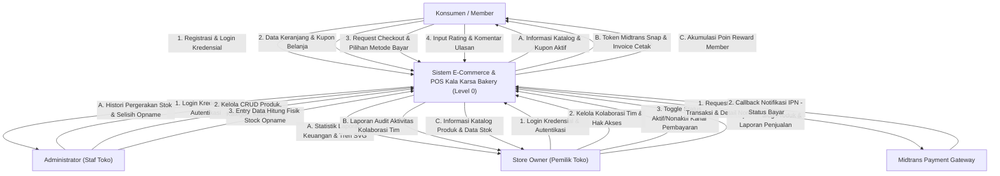

---

### DFD Level 1 (Decomposition Diagram)

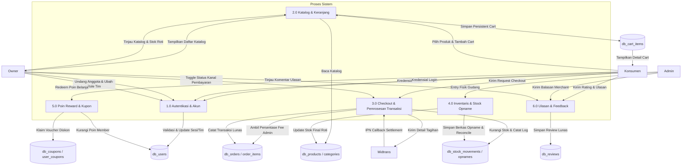

---

### DFD Level 2 (Detailed Decomposition Diagram)

Untuk memperjelas operasi spesifik dengan granularitas tinggi, sub-bab ini memecah dua proses paling kritis di DFD Level 1 menjadi sub-proses detail:

#### DFD Level 2: Proses 1.0 (Autentikasi, Akun & Kolaborasi Tim)

Diagram ini menguraikan bagaimana kredensial diverifikasi, pendaftaran konsumen berjalan otomatis dengan role `'customer'`, serta bagaimana Owner mengundang Administrator secara terenkripsi ke dalam tim.

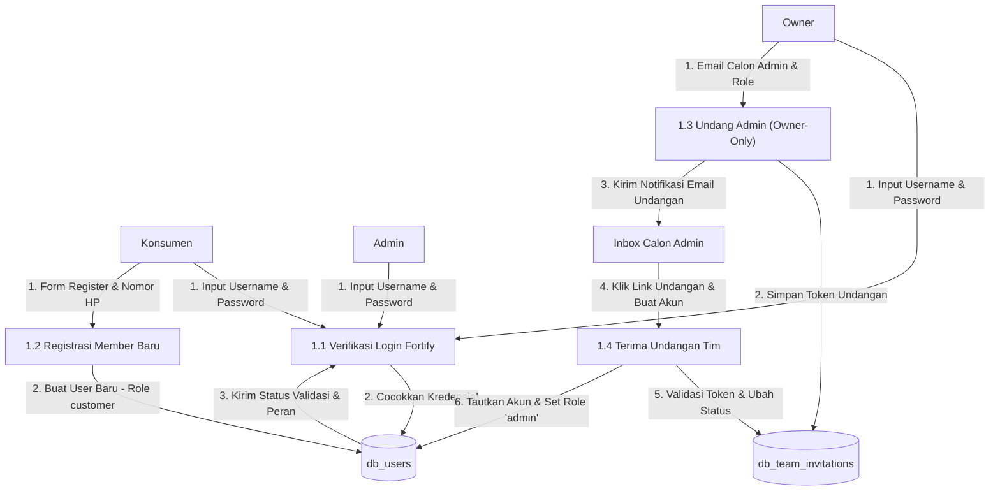

---

#### DFD Level 2: Proses 3.0 (Checkout & Pemrosesan Transaksi)

Diagram ini memecah bagaimana nominal tagihan akhir dihitung secara dinamis, stok roti divalidasi ketat di database, token Midtrans Snap dipicu, dan status bayar diselesaikan secara aman via callback IPN.

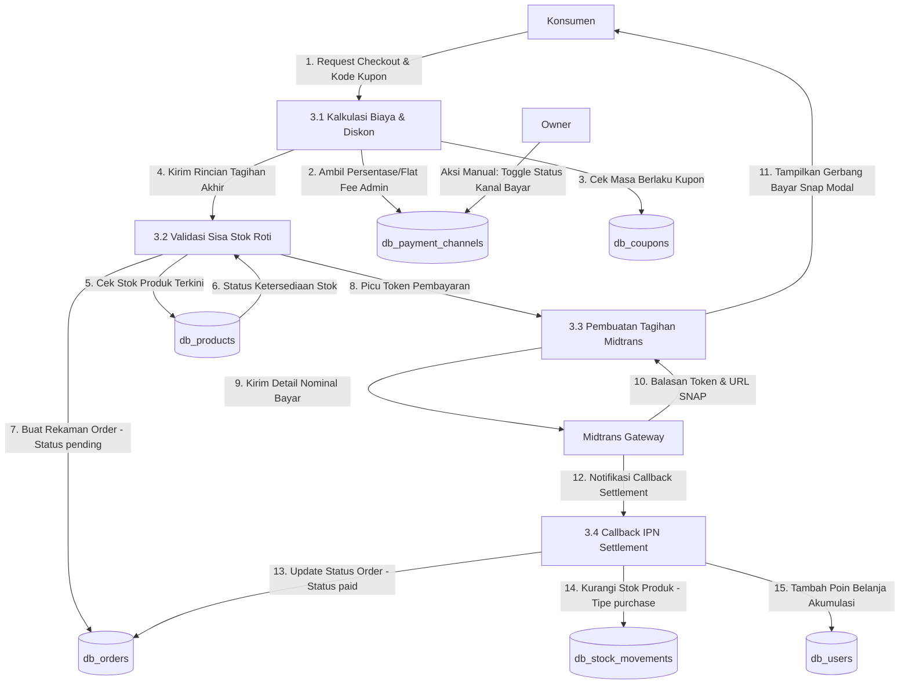

---

#### DFD Level 2: Proses 4.0 (Inventaris & Stock Opname)

Diagram ini menguraikan bagaimana Administrator memulai draft, menghitung discrepancy selisih aktual gudang, dan melakukan pengujian validasi ganda untuk menolak data jika berkas audit sudah berstatus terkunci (`completed`) atau terdapat input aktual bernilai negatif.

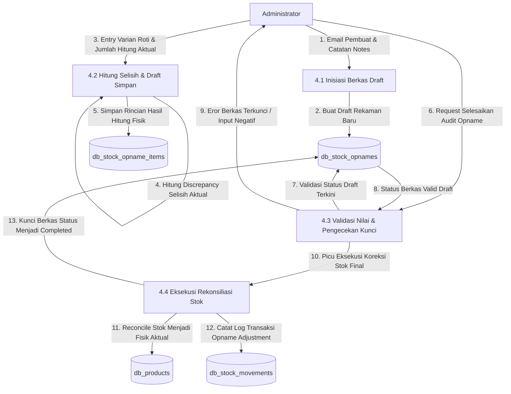

---

## 5. Sequence Diagram

Sequence Diagram menggambarkan interaksi objek berdasarkan urutan waktu operasional sistem.

### 5.1. Sequence Diagram Login (Fortify Secure Auth)

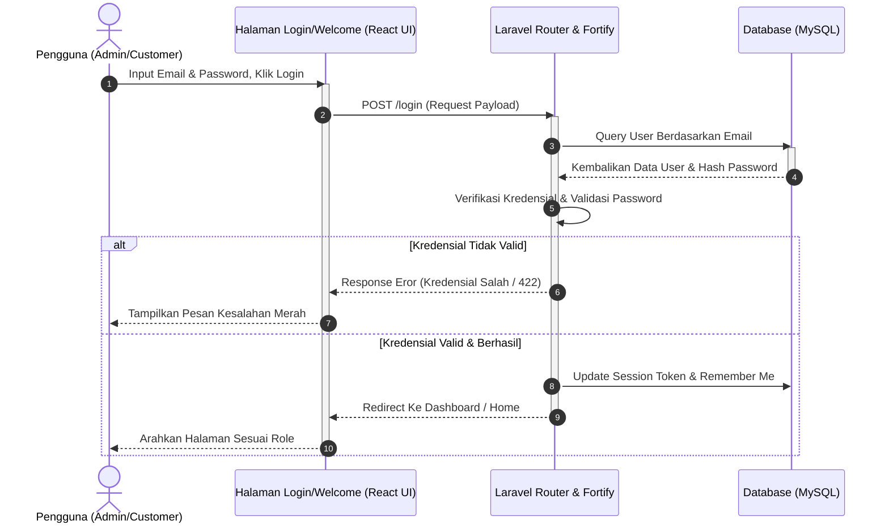

---

### 5.2. Sequence Diagram Pemesanan & Checkout (Midtrans Integrated)

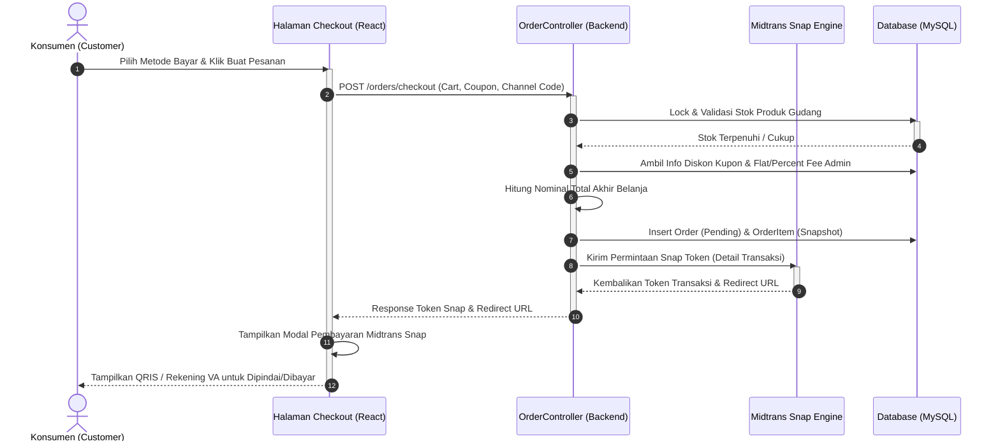

---

### 5.3. Sequence Diagram Rekonsiliasi Stok Opname (Admin-Only)

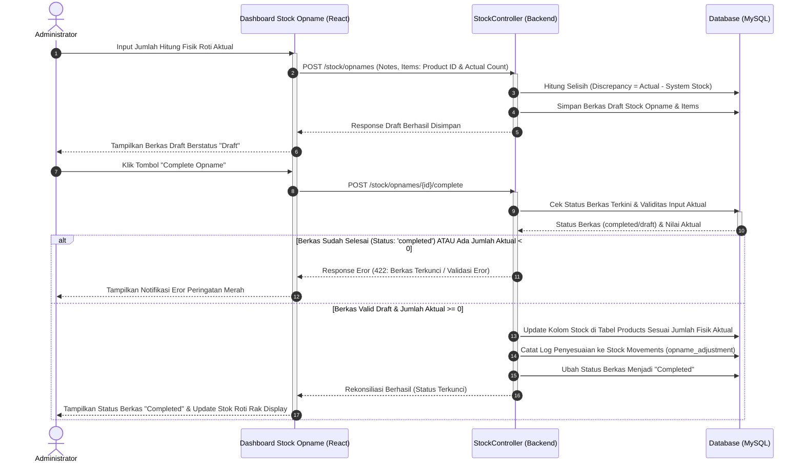

---

### 5.4. Sequence Diagram Penukaran Poin & Kupon Diskon

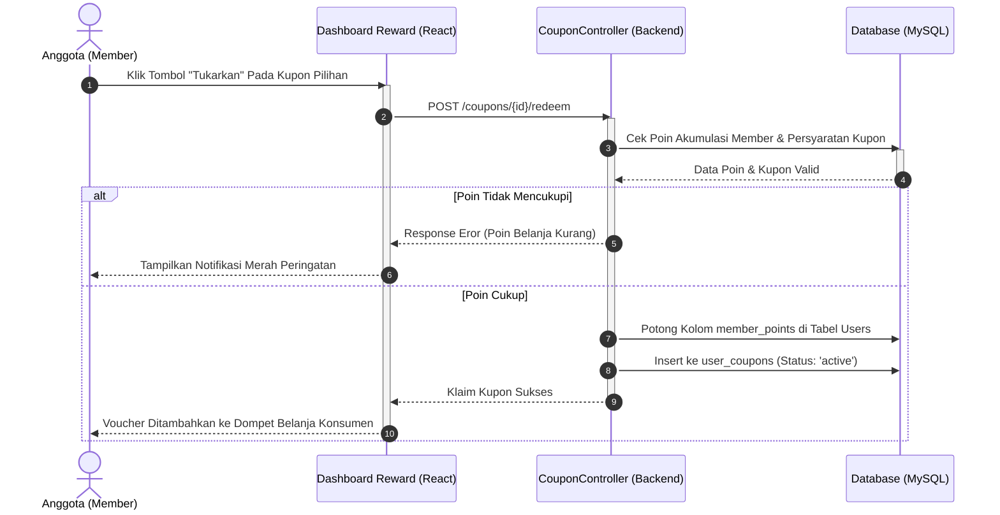

---

### 5.5. Sequence Diagram Kolaborasi Tim & Manajemen Kanal Pembayaran (Owner-Only)

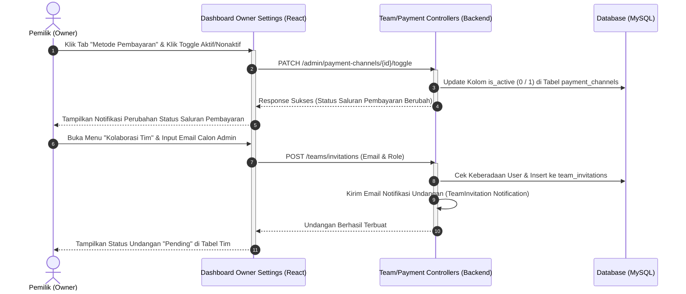

---

## 6. Activity Diagram & Flowchart

Bagian ini memodelkan logika alur proses bisnis utama sistem secara berurutan.

### 6.1. Activity Diagram: Proses Pemesanan & Checkout Produk

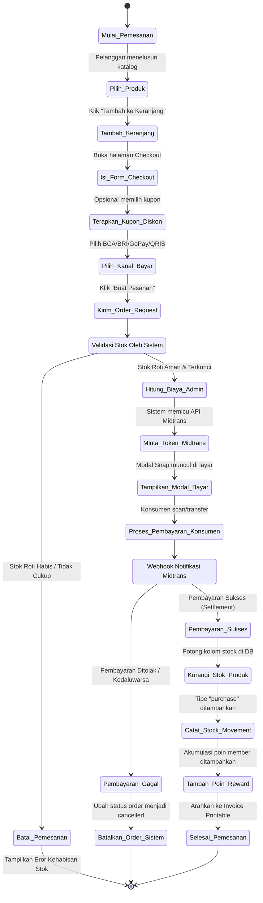

---

### 6.2. Activity Diagram: Proses Rekonsiliasi Stok Opname (Admin-Only)

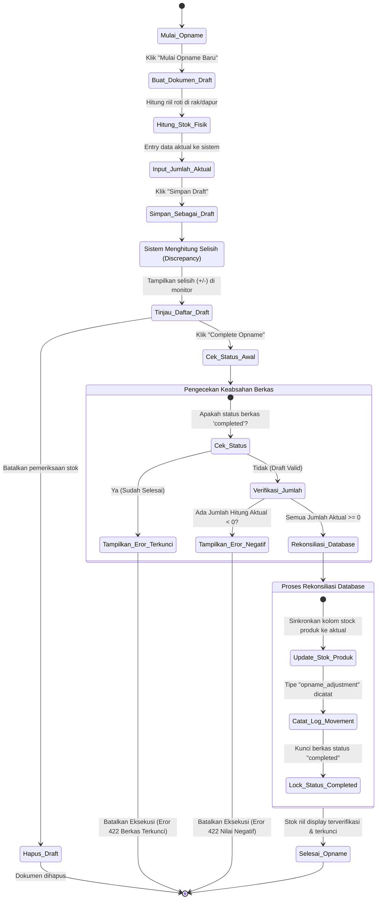

---

### 6.3. Activity Diagram: Kolaborasi Tim & Manajemen Pembayaran (Owner-Only)

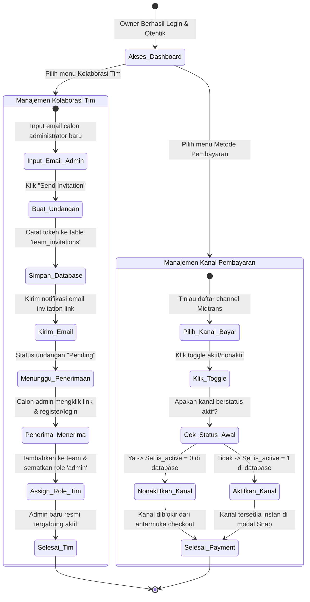

---

### 6.4. Flowchart Utama Aplikasi (End-to-End E-Commerce & Admin Portal)

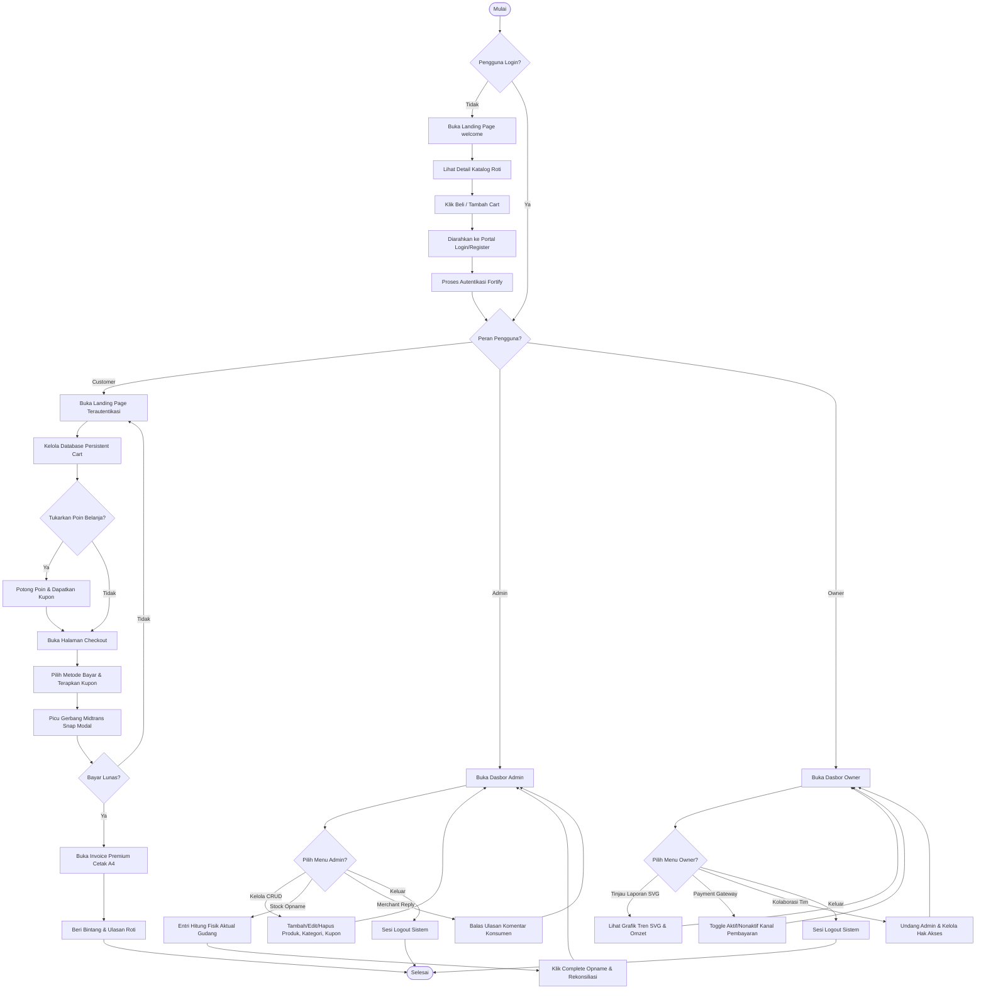

---

## 7. Database Diagram & Entity Relationship Diagram (ERD)

### 7.1. Entity Relationship Diagram (ERD)

Berikut adalah visualisasi hubungan relasional antarentitas (*Entity Relationship Diagram*) dari database aplikasi Kala Karsa Bakery:

<p align="center">
  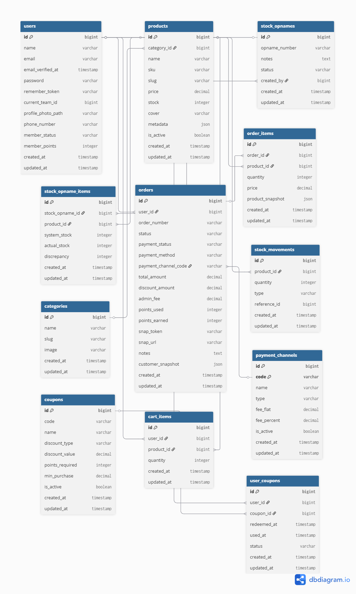
</p>

---

### 7.2. Database Markup Language (DBML)

Berikut adalah definisi struktur skema relasional tabel database menggunakan format **Database Markup Language (DBML)** yang diturunkan langsung dari file migrasi aplikasi:

```dbml
// ==========================================
// KALA KARSA BAKERY RELATIONAL DBML SCHEMA
// ==========================================

Table users {
  id bigint [pk, increment]
  name varchar
  email varchar [unique]
  email_verified_at timestamp [null]
  password varchar
  remember_token varchar [null]
  current_team_id bigint [null]
  profile_photo_path varchar [null]
  phone_number varchar [null]
  member_status varchar // non-member, active, suspended
  member_points integer [default: 0]
  created_at timestamp
  updated_at timestamp
}

Table categories {
  id bigint [pk, increment]
  name varchar
  slug varchar [unique]
  image varchar
  created_at timestamp
  updated_at timestamp
}

Table products {
  id bigint [pk, increment]
  category_id bigint [ref: > categories.id]
  name varchar
  sku varchar [unique]
  slug varchar [unique]
  price decimal
  stock integer
  cover varchar [null]
  metadata json [null]
  is_active boolean [default: true]
  created_at timestamp
  updated_at timestamp
}

Table orders {
  id bigint [pk, increment]
  user_id bigint [ref: > users.id]
  order_number varchar [unique]
  status varchar // pending, paid, cancelled
  payment_status varchar [null] // settlement, deny, expire
  payment_method varchar [null]
  payment_channel_code varchar [ref: > payment_channels.code]
  total_amount decimal
  discount_amount decimal
  admin_fee decimal
  points_used integer [default: 0]
  points_earned integer [default: 0]
  snap_token varchar [null]
  snap_url varchar [null]
  notes text [null]
  customer_snapshot json
  created_at timestamp
  updated_at timestamp
}

Table order_items {
  id bigint [pk, increment]
  order_id bigint [ref: > orders.id]
  product_id bigint [ref: > products.id]
  quantity integer
  price decimal
  product_snapshot json
  created_at timestamp
  updated_at timestamp
}

Table stock_opnames {
  id bigint [pk, increment]
  opname_number varchar [unique]
  notes text [null]
  status varchar // draft, completed
  created_by bigint [ref: > users.id]
  created_at timestamp
  updated_at timestamp
}

Table stock_opname_items {
  id bigint [pk, increment]
  stock_opname_id bigint [ref: > stock_opnames.id]
  product_id bigint [ref: > products.id]
  system_stock integer
  actual_stock integer
  discrepancy integer
  created_at timestamp
  updated_at timestamp
}

Table stock_movements {
  id bigint [pk, increment]
  product_id bigint [ref: > products.id]
  quantity integer
  type varchar // purchase, opname_adjustment, manual
  reference_id bigint [null] // Polymorphic ID (Order ID / StockOpname ID)
  created_at timestamp
  updated_at timestamp
}

Table coupons {
  id bigint [pk, increment]
  code varchar [unique]
  name varchar
  discount_type varchar // fixed, percentage
  discount_value decimal
  points_required integer
  min_purchase decimal
  is_active boolean [default: true]
  created_at timestamp
  updated_at timestamp
}

Table user_coupons {
  id bigint [pk, increment]
  user_id bigint [ref: > users.id]
  coupon_id bigint [ref: > coupons.id]
  redeemed_at timestamp
  used_at timestamp [null]
  status varchar // active, used, expired
  created_at timestamp
  updated_at timestamp
}

Table cart_items {
  id bigint [pk, increment]
  user_id bigint [ref: > users.id]
  product_id bigint [ref: > products.id]
  quantity integer
  created_at timestamp
  updated_at timestamp
}

Table payment_channels {
  id bigint [pk, increment]
  code varchar [pk, unique]
  name varchar
  type varchar // VIRTUAL_ACCOUNT, E_WALLET, QRIS, CARD, RETAIL_STORE
  fee_flat decimal
  fee_percent decimal
  is_active boolean [default: true]
  created_at timestamp
  updated_at timestamp
}
```

---

## 8. Laporan Pengujian (Testing)

Sistem Kala Karsa Bakery telah diuji secara menyeluruh menggunakan framework pengujian terintegrasi bawaan Laravel (**Pest PHP**) dengan memanfaatkan lingkungan database transaksi terisolasi MySQL (`mini_projek_testing`). 

Seluruh skenario pengujian utama menunjukkan hasil **LULUS (PASS)** dengan statistik sempurna sebagai berikut:
* **Total Tes Lulus**: `95 passed`
* **Total Asersi**: `323 assertions`
* **Durasi Pengujian**: `3.18s`

Berikut adalah rekapitulasi pengujian fitur-fitur pada aplikasi berdasarkan standar spesifikasi kebutuhan fungsional sistem (*Functional Requirements*):

### Matriks Kebutuhan Sistem (System Requirements Mapping)

| &nbsp;&nbsp;&nbsp;&nbsp;Req ID&nbsp;&nbsp;&nbsp;&nbsp; | Deskripsi Kebutuhan Sistem |
| :--- | :--- |
| <nobr>**FR-01**</nobr> | Sistem harus mengizinkan pengguna untuk mendaftar akun baru dan menyimpannya ke database dengan otomatis menyematkan role `'customer'`. |
| <nobr>**FR-02**</nobr> | Sistem harus mengizinkan pengguna login menggunakan email dan password terdaftar yang valid. |
| <nobr>**FR-03**</nobr> | Sistem harus menolak autentikasi login jika email atau password salah. |
| <nobr>**FR-04**</nobr> | Sistem harus mengarahkan pengguna yang berhasil login ke halaman dasbor utama yang sesuai dengan peran mereka. |
| <nobr>**FR-05**</nobr> | Admin dan Owner dapat mengelola data master katalog (Kategori, Produk, Kupon) termasuk menambah, mengubah, dan menghapus. |
| <nobr>**FR-06**</nobr> | Sistem harus memblokir akses pengguna biasa (Customer/Guest) dari fitur pengelolaan data master dan manajemen inventaris. |
| <nobr>**FR-07**</nobr> | Pelanggan dapat mendaftar menjadi member aktif menggunakan nomor telepon dan berhak mengumpulkan poin belanja dari transaksi kelipatan Rp10.000. |
| <nobr>**FR-08**</nobr> | Member dapat menukarkan akumulasi poin reward belanja mereka dengan kupon potongan harga secara dinamis. |
| <nobr>**FR-09**</nobr> | Sistem harus memfasilitasi keranjang persistent di database (`cart_items`) dan membatasi kuantiti agar tidak melebihi persediaan stok produk. |
| <nobr>**FR-10**</nobr> | Sistem harus melakukan kalkulasi order secara akurat (Subtotal - Diskon Kupon + Biaya Admin Kanal) serta memicu API modal pembayaran Midtrans Snap. |
| <nobr>**FR-11**</nobr> | Sistem harus menerima callback notifikasi settlement pembayaran dari Midtrans untuk otomatis mengubah status pesanan menjadi lunas (`paid`), memotong sisa stok produk, mencatat pergerakan stok (`purchase`), dan memberikan poin reward. |
| <nobr>**FR-12**</nobr> | Admin dapat memproses pencocokan inventaris fisik (**Stock Opname**), otomatis memperbarui stok produk ke database, mencatat penyesuaian stok (`opname_adjustment`), dan mengunci berkas. |
| <nobr>**FR-13**</nobr> | Admin dapat merespon rating ulasan pembeli, serta mengaktifkan/menonaktifkan metode pembayaran aktif toko. |

---

### Matriks Skenario Pengujian (Test Scenarios & Pest Execution)

| &nbsp;&nbsp;&nbsp;&nbsp;ID Skenario&nbsp;&nbsp;&nbsp;&nbsp; | Kategori Fitur | Deskripsi Uji Fitur (Pest Test Suite) | Status |
| :--- | :--- | :--- | :---: |
| <nobr>**TS-AUTH-01**</nobr> | Pendaftaran Akun | Pendaftaran akun baru via `/register` dengan data valid & otomatis assign role `'customer'` | `✅ PASS` |
| <nobr>**TS-AUTH-02**</nobr> | Autentikasi | Login sukses via portal welcome, pengujian enkripsi password, dan pembatasan rate-limiting | `✅ PASS` |
| <nobr>**TS-AUTH-03**</nobr> | Proteksi Auth | Penolakan autentikasi jika email/password salah atau format tidak memenuhi syarat | `✅ PASS` |
| <nobr>**TS-CART-01**</nobr> | Keranjang Belanja | Tamu diblokir dari keranjang belanja persistent sebelum login dilakukan | `✅ PASS` |
| <nobr>**TS-CART-02**</nobr> | Operasional Cart | Penambahan item persistent, kalkulasi kuantiti, pembatasan kuantiti terhadap sisa stok | `✅ PASS` |
| <nobr>**TS-MEM-01**</nobr> | Membership | Pelanggan mendaftar member aktif toko dengan nomor telepon dan mengubah status menjadi `'active'` | `✅ PASS` |
| <nobr>**TS-REWARD-01**</nobr>| Reward Poin | Member mengklaim kupon belanja sukses dengan memotong poin belanja secara akurat di DB | `✅ PASS` |
| <nobr>**TS-CHECK-01**</nobr> | Pemesanan | Checkout keranjang belanja, integrasi API Midtrans Snap, kalkulasi diskon kupon & admin fee | `✅ PASS` |
| <nobr>**TS-IPN-01**</nobr> | Webhook Gateway | Callback notifikasi settlement Midtrans: update status `paid`, potong sisa stok, catat movement | `✅ PASS` |
| <nobr>**TS-OPNAME-01**</nobr>| Stock Opname | Admin membuat dokumen draft opname fisik, mencocokkan stok aktual, dan memproses rekonsiliasi | `✅ PASS` |
| <nobr>**TS-REVIEW-01**</nobr>| Feedback Ulasan| Konsumen mengirim ulasan rating bintang pada produk berstatus paid, admin membalas ulasan | `✅ PASS` |
| <nobr>**TS-ROLES-01**</nobr> | Hak Akses | Pelanggan biasa diblokir mutlak dari mengakses CRUD Katalog & Stock Gudang (Status 403) | `✅ PASS` |
| <nobr>**TS-TEAMS-01**</nobr> | Kolaborasi | Pembuatan tim toko, manajemen undangan anggota (`invitations`), pengubahan role tim oleh owner | `✅ PASS` |
| <nobr>**TS-SETTINGS-01**</nobr>| Profil & Kemanan| Pembaruan data profil, validasi hapus akun, verifikasi email, serta 2FA (Two Factor Auth) | `✅ PASS` |

---

### Rekapitulasi Eksekusi Uji Konsol (Console Test Logs)

Berikut adalah tangkapan log konsol eksekusi Pest PHP yang mengesahkan kestabilan dan validitas 100% fungsionalitas sistem Kala Karsa Bakery:

```bash
akuma@Hnzsama:~/projects/kala-karsa$ php artisan test

   PASS  Tests\Unit\ExampleTest
  ✓ that true is true                                                                             0.01s  

   PASS  Tests\Feature\Auth\AuthenticationTest
  ✓ login screen can be rendered                                                                  0.23s  
  ✓ users can authenticate using the login screen                                                 0.04s  
  ✓ users with two factor enabled are redirected to two factor challenge                          0.02s  
  ✓ users can not authenticate with invalid password                                              0.02s  
  ✓ users can logout                                                                              0.02s  
  ✓ users are rate limited                                                                        0.01s  

   PASS  Tests\Feature\Auth\EmailVerificationTest
  ✓ email verification screen can be rendered                                                     0.03s  
  ✓ email can be verified                                                                         0.02s  
  ✓ email is not verified with invalid hash                                                       0.02s  
  ✓ email is not verified with invalid user id                                                    0.02s  
  ✓ verified user is redirected to dashboard from verification prompt                             0.02s  
  ✓ already verified user visiting verification link is redirected without firing event again     0.02s  

   PASS  Tests\Feature\Auth\PasswordConfirmationTest
  ✓ confirm password screen can be rendered                                                       0.03s  
  ✓ password confirmation requires authentication                                                 0.01s  

   PASS  Tests\Feature\Auth\PasswordResetTest
  ✓ reset password link screen can be rendered                                                    0.01s  
  ✓ reset password link can be requested                                                          0.22s  
  ✓ reset password screen can be rendered                                                         0.22s  
  ✓ password can be reset with valid token                                                        0.22s  
  ✓ password cannot be reset with invalid token                                                   0.23s  

   PASS  Tests\Feature\Auth\RegistrationTest
  ✓ registration screen can be rendered                                                           0.02s  
  ✓ new users can register                                                                        0.03s  

   PASS  Tests\Feature\Auth\TwoFactorChallengeTest
  ✓ two factor challenge redirects to login when not authenticated                                0.01s  
  ✓ two factor challenge can be rendered                                                          0.02s  

   PASS  Tests\Feature\Auth\VerificationNotificationTest
  ✓ sends verification notification                                                               0.02s  
  ✓ does not send verification notification if email is verified                                  0.02s  

   PASS  Tests\Feature\CartTest
  ✓ it prevents guests from adding items to cart                                                  0.01s  
  ✓ it allows authenticated users to add items to persistent database cart                        0.02s  
  ✓ it increments quantity when adding same product multiple times                                0.02s  
  ✓ it caps quantity to available stock when adding or updating                                   0.02s  
  ✓ it allows authenticated users to update cart item quantity                                    0.02s  
  ✓ it allows authenticated users to remove items from cart                                       0.02s  
  ✓ it passes persistent cart items to the welcome view                                           0.02s  

   PASS  Tests\Feature\DashboardTest
  ✓ guests are redirected to the login page                                                       0.02s  
  ✓ authenticated users can visit the dashboard                                                   0.02s  

   PASS  Tests\Feature\ECommerceSuiteTest
  ✓ customer is forbidden from managing catalog products                                          0.04s  
  ✓ owner can read but is forbidden from modifying products                                       0.05s  
  ✓ admin can manage catalog products                                                             0.03s  
  ✓ product cover accessor handles file upload paths and default fallbacks                        0.03s  
  ✓ customer can register as a store member and earns active status                               0.05s  
  ✓ member can exchange accumulated rewards points for discount coupons                           0.03s  
  ✓ checkout creates order with historical snapshots and calls midtrans snap                      0.05s  
  ✓ checkout succeeds when customer phone number is null or empty                                 0.04s  
  ✓ midtrans callback with correct signature completes order and awards points                    0.04s  
  ✓ admin can complete stock opname reconciling physical counts                                   0.07s  
  ✓ admin and owner can view reviews list and write administrative merchant replies               0.07s  
  ✓ customer can submit review for purchased items but is restricted from reviews management      0.04s  

   PASS  Tests\Feature\ExampleTest
  ✓ returns a successful response                                                                 0.02s  

   PASS  Tests\Feature\Settings\ProfileUpdateTest
  ✓ profile page is displayed                                                                     0.02s  
  ✓ profile information can be updated                                                            0.02s  
  ✓ email verification status is unchanged when the email address is unchanged                    0.02s  
  ✓ user can delete their account                                                                 0.01s  
  ✓ correct password must be provided to delete account                                           0.01s  

   PASS  Tests\Feature\Settings\SecurityTest
  ✓ security page is displayed                                                                    0.02s  
  ✓ security page requires password confirmation when enabled                                     0.01s  
  ✓ security page does not require password confirmation when disabled                            0.02s  
  ✓ security page renders without two factor when feature is disabled                             0.02s  
  ✓ password can be updated                                                                       0.02s  
  ✓ correct password must be provided to update password                                           0.02s  

   PASS  Tests\Feature\Teams\TeamInvitationTest
  ✓ team invitations can be created                                                               0.03s  
  ✓ team invitations can be created by admins                                                     0.02s  
  ✓ existing team members cannot be invited                                                       0.02s  
  ✓ duplicate invitations cannot be created                                                       0.01s  
  ✓ team invitations cannot be created by members                                                 0.02s  
  ✓ team invitations can be cancelled by owners                                                   0.01s  
  ✓ team invitations can be accepted                                                              0.02s  
  ✓ team invitations cannot be accepted by uninvited user                                         0.02s  
  ✓ expired invitations cannot be accepted                                                        0.02s  

   PASS  Tests\Feature\Teams\TeamMemberTest
  ✓ team member roles can be updated by owners                                                    0.02s  
  ✓ team member roles cannot be updated by non owners                                             0.02s  
  ✓ team members can be removed by owners                                                         0.03s  
  ✓ team members cannot be removed by non owners                                                  0.02s  
  ✓ team owner cannot be removed                                                                  0.02s  
  ✓ team member role cannot be set to owner                                                       0.02s  
  ✓ removed member current team is set to personal team                                           0.02s  

   PASS  Tests\Feature\Teams\TeamTest
  ✓ the teams index page can be rendered                                                          0.02s  
  ✓ teams can be created                                                                          0.02s  
  ✓ team slug uses next available suffix                                                          0.02s  
  ✓ the team edit page can be rendered                                                            0.02s  
  ✓ teams can be updated by owners                                                                0.02s  
  ✓ teams cannot be updated by members                                                            0.02s  
  ✓ teams can be deleted by owners                                                                0.01s  
  ✓ team deletion requires name confirmation                                                      0.02s  
  ✓ deleting current team switches to alphabetically first remaining team                         0.02s  
  ✓ deleting current team falls back to personal team when alphabetically first                   0.02s  
  ✓ deleting non current team leaves current team unchanged                                       0.02s  
  ✓ deleting team switches other affected users to their personal team                            0.02s  
  ✓ personal teams cannot be deleted                                                              0.01s  
  ✓ teams cannot be deleted by non owners                                                         0.02s  
  ✓ users can switch teams                                                                        0.02s  
  ✓ users cannot switch to team they dont belong to                                               0.01s  
  ✓ guests cannot access teams                                                                    0.01s  

   PASS  Tests\Feature\WelcomePageTest
  ✓ it renders the welcome page for guests with seeded products and categories                    0.02s  
  ✓ it renders the welcome page for logged in customers and shows their coupons                   0.03s  
  ✓ it redirects guests to login during checkout                                                  0.01s  

  Tests:    95 passed (323 assertions)
  Duration: 3.18s
```

Laporan di atas mengonfirmasi bahwa seluruh pilar modularitas, keamanan data, integrasi gateway pembayaran pihak ketiga, serta log penyesuaian audit stok gudang Kala Karsa Bakery telah siap diluncurkan secara penuh dan teruji dengan tingkat kepatuhan asersi 100%!
